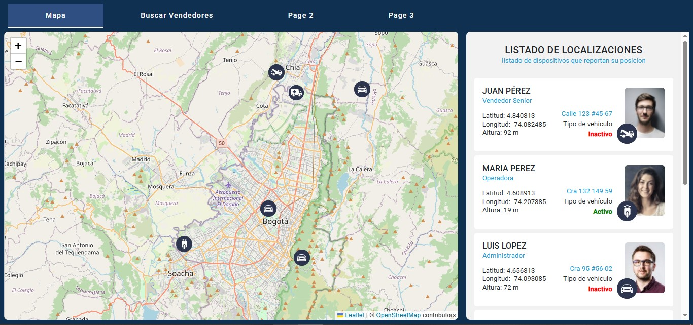
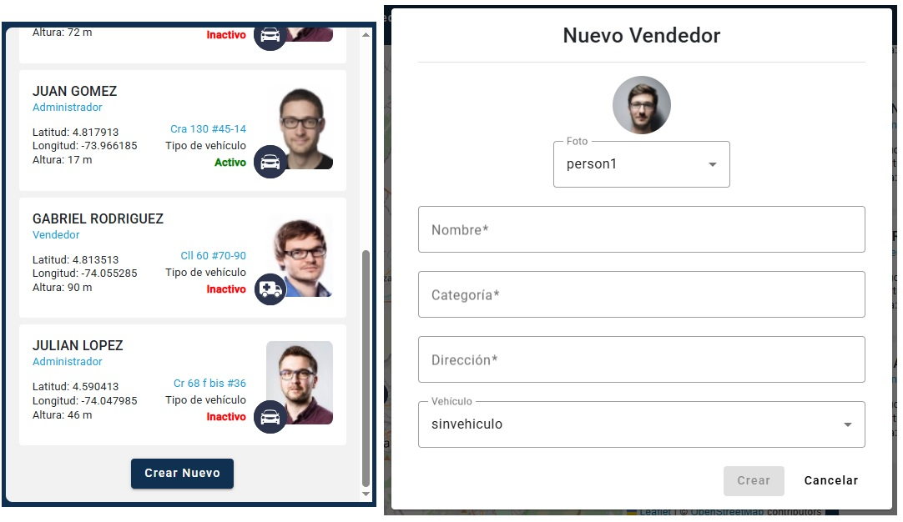
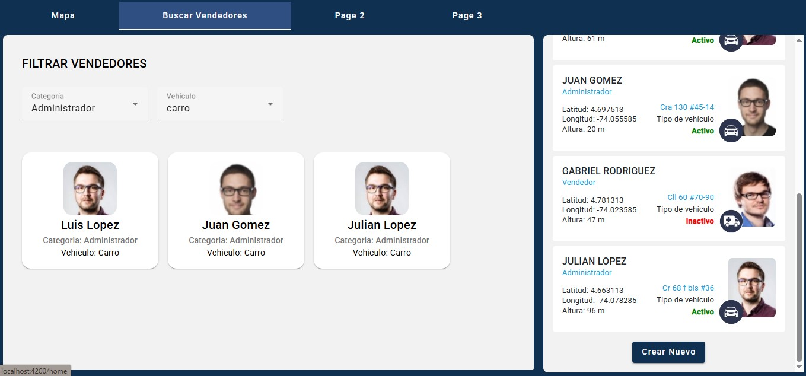
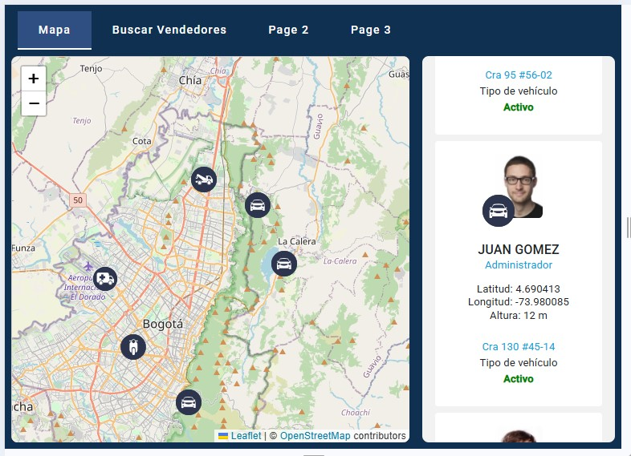
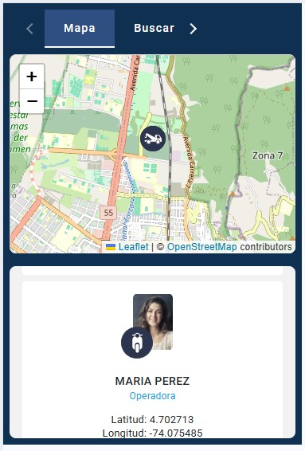

# Prueba Técnica Frontend – GCA

## Descripción

Esta aplicación web se desarrollo en **Angular 16**, en las que se buscaba:

- Mostrar un listado de vendedores obtenidos desde un **API REST**.
- Visualizar la ubicación de cada vendedor en un **mapa interactivo**.
- Actualizacion de la ubicacion de los vendedores en tiempo real
- Crear nuevos vendedores con formulario reactivo.
- Navegar entre secciones (Mapa, Busqueda de Vendedores, etc).

---

## Tecnologías y librerías

- **Framework:** Angular 16
- **Lenguaje:** TypeScript
- **Estilos:** SASS (SCSS)
- **UI:** Angular Material + custom components
- **Mapas:** Leaflet + OpenStreetMap
- **Reactividad:** RxJS
- **Control de versiones:** Git

---

## Caracteristicas

La aplicaion cuenta con 2 pestañas principalmente, con la idea de mostrar de manera consisa y lo mas claro posible la informacion traida con las peticiones al API.

### Mapa

La pestaña principal cuenta de 2 partes un mapa interactivo y un listado de los venderos, para el mapa utilize el de Leaflet, el cual estile los pines o markas para que se visualizaran los vendedores con los svg de los vehiculos, ademas agregue el dialog que muestra un resumen del vendedor y cambia el pin por el de seleccionado.

La otra sesion que es el listado, muestra en cards la informacion de las cordenadas de los vendedores junto a la foto de la persona, su nombre, la direccion, la categoria, el estado activo o inactivo y un svg del vehiculo, tambien coloque el boton para crear un nuevo vendedor, el cual muestra una modal para ingresar los datos.

Como requerimiento la informacion consumida por la api se va actualizando cada 30 segundos.

### Buscar Vendedores

Como agregado decide hacer unos filtros que separan por categoria y vehiculos la informacion de los vendedores, estos se muestran en cards con foto, nombre, la categoria y el vehiculo.

### Page

En las dos pestañas finales solo agregue un titulo de proximamente.

## Diseño Responsivo

Se aplico estilos para la visualizacion en otros dispositivos

**Tablet**

**Celular**

---

## Contacto

**Autor:** Christian David Lezcano

**Email:** christianlezcano878@gmail.com

---

*Gracias por la oportunidad de presentar esta prueba técnica.*